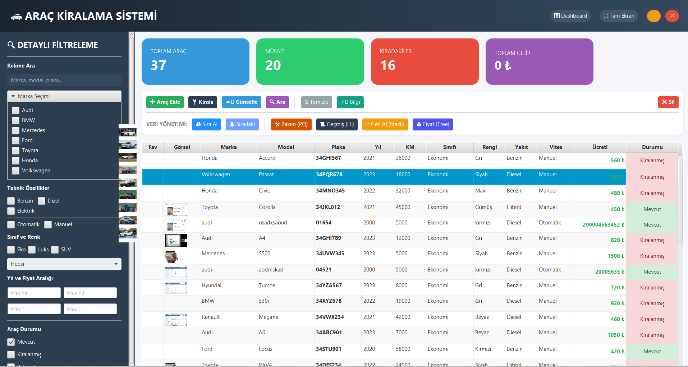

# Car Rental System - Data Structures Project

This project is a desktop car rental management system developed using Java and JavaFX. It was created as part of a data structures course to demonstrate the practical application of fundamental data structures.



---

## 💡 Data Structures Used

This project utilizes 6 core data structures to efficiently manage the system's various functions. The purpose of each data structure is explained below:

| Data Structure | Use Case | Purpose |
| :--- | :--- | :--- |
| **HashMap** | Vehicle Database | Stores vehicles as `(key, value)` pairs with a unique ID, providing fast access to vehicle information with O(1) complexity. |
| **Stack** | Undo Operations | Pushes recent actions (e.g., deleting a vehicle) onto a stack, allowing these actions to be reversed with an "Undo" feature. |
| **Priority Queue** | Maintenance Management | Manages vehicle maintenance priority (e.g., based on the time since the last service). Finds the vehicle most urgently needing maintenance with O(log n) complexity. |
| **Linked List** | Rental History | Maintains the rental history for each vehicle or general transaction logs in a time-ordered sequence using a linked list structure. |
| **Binary Search Tree** | Sort/Search by Price | Organizes vehicles in a binary search tree based on their daily rental fees. This facilitates efficient listing of vehicles by price and searching within a specific price range. |
| **Dynamic Array (ArrayList)** | Table Data Management | Manages the list of vehicles displayed in the JavaFX `TableView` component within a dynamic array (ObservableList). It allows for the flexible display of filtered or sorted data in the user interface. |

---

## 🚀 Running the Project

Follow the steps below to run the project on your local machine:

### Prerequisites

- **Java Development Kit (JDK)** 11 or higher
- **Apache Maven**
- **JavaFX SDK**

### Installation Steps

1.  **Clone the Project:**
    ```bash
    git clone https://github.com/Egekocaslqn00/CarRentalSystem-DataStructures.git
    cd CarRentalSystem-DataStructures
    ```

2.  **Install Maven Dependencies:**
    While in the project's root directory, run the following command to install the necessary dependencies (like JavaFX).
    ```bash
    mvn clean install
    ```

3.  **Run the Project:**
    Use the following command to run the project via Maven:
    ```bash
    mvn javafx:run
    ```

4.  **Running with an IDE (IntelliJ IDEA / Eclipse):
    - Import the project into your IDE as a Maven project.
    - Locate the `src/main/java/arac/Main.java` file.
    - Run the `Main` class to start the application.
    - **Note:** If JavaFX is not installed globally, you may need to add the JavaFX modules to your IDE's VM options.

---

## 📁 Project Structure

- `src/main/java/arac/`: Contains the Java source code.
  - `Main.java`: The entry point of the application.
  - `AracKiralamaController.java`: The controller class that manages the logic for the main dashboard.
  - `Arac.java`: The model class that defines the properties of vehicle objects.
  - `DataManager.java`: Manages reading and writing vehicle data from the `araclar.txt` file.
  - Other classes: Helper classes that manage data structures and UI components.
- `src/main/resources/arac/`: Contains FXML UI files and CSS style files.
- `araclar.txt`: A text-based database where vehicle data is stored.
- `pom.xml`: Contains the project's Maven dependencies and configuration settings.
